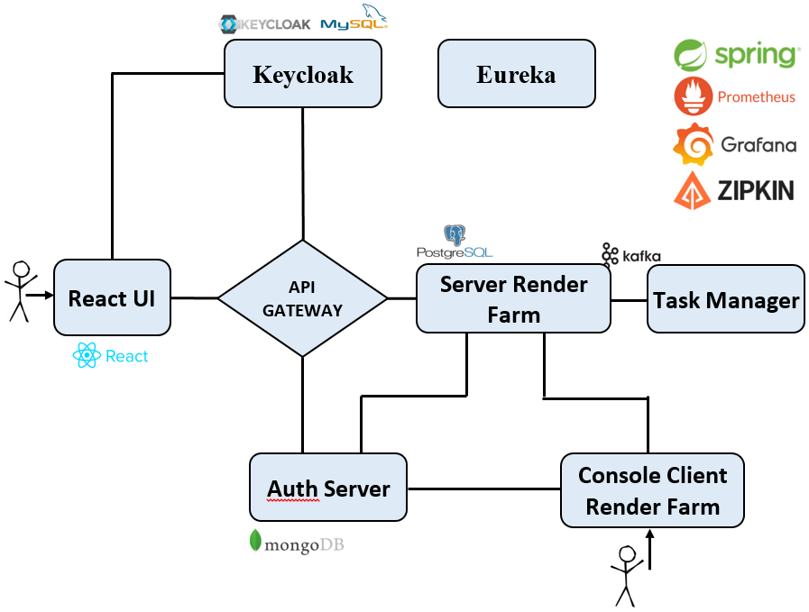

Render farm
---

## Applications
* `api-gateway` - single entry point for web applications and APIs
* `discovery-server` - eureka server
* `auth-service` - authorization Server
* `server-prototype-render-farm` - application for working with tasks
* `client-prototype-render-farm` - console application for working with tasks
* `task-manager` - performs long-term work with tasks
* `lib-common` - library for storing shared data
* `lib-response-wrapper` - starter for adding additional logic for controllers
* `lib-actuator` - starter for custom logic with metrics collection
* `ui-prototype-render-farm` - React client application.

## Block diagram
</br>

## Prerequisites
* `Java 17`
* `npm`
* `Docker`

## How to run the application using Docker

1. Run `mvn clean package -DskipTests` to build the applications and create the docker image locally.
2. Run `docker-compose up -d` to start the applications.

## How to run the application without Docker

1. Run `mvn clean verify -DskipTests` by going inside each folder to build the applications.
2. After that run `mvn spring-boot:run` by going inside each folder to start the applications.

## Jib
If you need to add images to your DockerHub, then use settings.xml</br>
Example:
```xml
<settings xmlns="http://maven.apache.org/SETTINGS/1.0.0" xmlns:xsi="http://www.w3.org/2001/XMLSchema-instance"
          xsi:schemaLocation="http://maven.apache.org/SETTINGS/1.0.0 https://maven.apache.org/xsd/settings-1.0.0.xsd">
    <localRepository/>
    <interactiveMode/>
    <offline/>
    <pluginGroups/>
    <servers>
        <server>
            <id>registry.hub.docker.com</id>
            <username>*******</username>
            <password>*******</password>
        </server>
    </servers>
    <mirrors/>
    <proxies/>
    <profiles/>
    <activeProfiles/>
</settings>
```
